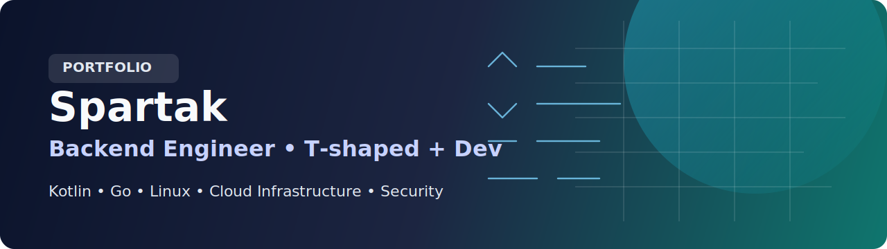
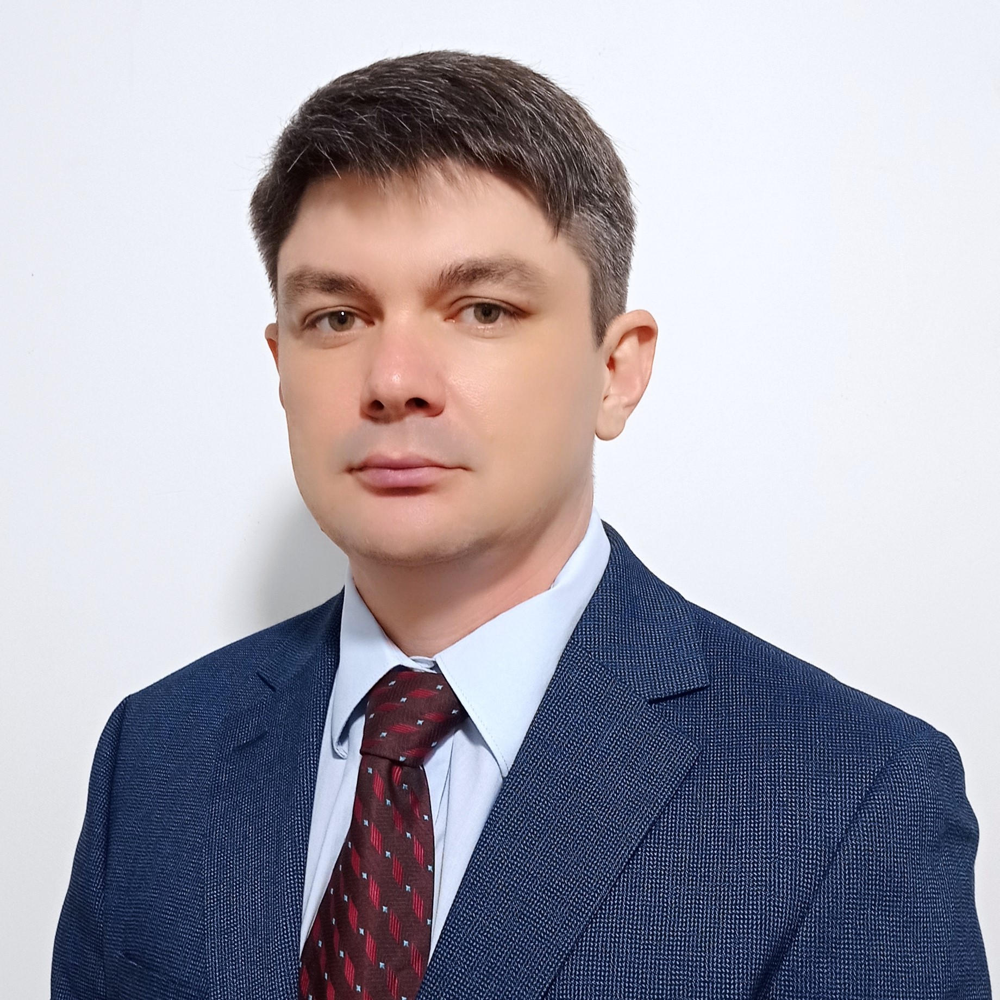

  

  
  
  

## Hi, I am Spartak

I live in a small town in the south of Russia, in Elista, together with my beloved wife, our wonderful children, and our ginger cat.
In my free time, I enjoy cycling outside the city, traveling with my family, and working on small engineering projects together with my children.
Through these projects, they get hands-on experience with core engineering concepts:
reading documentation, electronics, soldering, and programming.

My journey into computer science began in 1992, when I was in the first grade and first saw an IBM PC based on an Intel 80286 processor. That moment made a strong impression on me,
and I knew I wanted to become a programmer.

 

At the age of 13, I assembled my first computer built around a Celeron 333A processor.
A year later, I wrote my first program in Turbo Pascal 7.0.
At 17, I graduated from Elista Polytechnic College with a specialization in computer programming, computer hardware, and automated systems software,
and soon after started my first job as a programmer.

That marked the beginning of my professional career in IT.

Alongside practical work, I continue my academic development.
I am currently pursuing a Master's degree at ITMO University,
at the Institute of Applied Computer Science, in the field of Cloud Engineering.

My Master's thesis focuses on the security of containerized systems and software supply chains.
The `contain-sentry` project is the practical part of this work and is used
to research and formalize security checks for container builds.

## Snapshot

- Current role: Infrastructure and Platform Engineering at MWS Cloud (backend focus, platform engineering, T-shaped profile)
- Academic track: Master's degree at ITMO University, Cloud Engineering
- Master's thesis: Development of a methodology for creating and operating secure containers
- Practical research project: `contain-sentry`

## Core Expertise

- Backend engineering: API design, service architecture, distributed systems
- Platform engineering: provisioning, node lifecycle automation, reliability
- DevOps: Docker, Kubernetes, Terraform, GitHub Actions, CI/CD pipelines
- Security: container hardening, policy-as-code, software supply-chain control

## Projects

- [`contain-sentry`](https://github.com/katvixlab/contain-sentry): Security checks for Dockerfiles and container builds (policy-as-code)
- [`xray-tlg`](https://github.com/katvixlab/xray-tlg): Go Telegram bot for managing Xray/V2Ray on Linux
- [`CoachDesk`](https://github.com/katvixlab/otus-kotlin-homework): Kotlin backend for a fitness coach CRM
- [`Kittygram`](https://github.com/katvixlab/bonus2k-cloud-services-engineer-vm-kittygram-final): Microservices app with Terraform-based delivery and CI/CD

## Technology Stack

`Go` `Kotlin` `Java` `Linux` `Docker` `Kubernetes` `Terraform` `Ansible` `GitHub Actions`

## Contacts

- Telegram: [@snkatvit](https://t.me/snkatvit)
